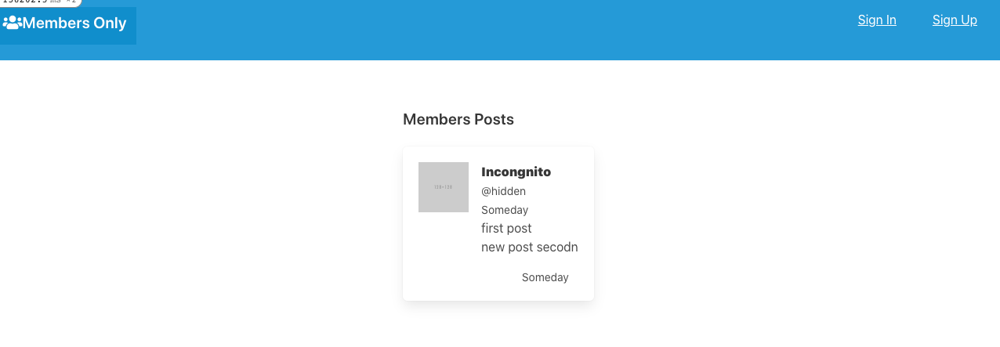

 ?style=plastic&logo=ruby>)

# Members-Only

> In this app, we elaborate authentications for the member so that he can have access to create, delete and modify if he is a registered user. If you are not a registered user, you can only look at the publications but without knowing who the author was or any reference to posts.

## Usage 

- Clone the repo: $ git clone
- Run `bundle install`  in your terminal to install the Ruby gems.
- Run `rails db:migrate`  in your terminal to create the databases.
- Run `$ rails server` to start your local host.
- In your terminal go to (http://127.0.0.1:3000/) 
- Sign up for a session and write new "secrets" or you can just watch them anonymously!
## BUILT WITH

- Ruby
- ROR 
- SQLite3
- Bulma
- Devise

## AUTHORS

👤 **Manuel Aldaraca**

- GitHub: [@vicmaburrito](https://github.com/vicmaburrito)
- Twitter: [@ManuelAldaraca](https://twitter.com/ManuelAldaraca)
- LinkedIn: [Manuel Aldaraca](https://www.linkedin.com/in/manuelaldaraca/)

👤 **Daniel Samuel**

- GitHub: [@DanSam5K ](https://github.com/DanSam5K)
- Twitter: [@_dan_sam](https://twitter.com/_dan_sam)
- LinkedIn: [Daniel Samuel](https://www.linkedin.com/)

## SHOW YOUR SUPPORT
Give a ⭐️ if you like the project

## 🤝 CONTRIBUTING
- Contributions, issues, and feature requests are welcome!
Feel free to check the [issues page](https://github.com/DanSam5K/members-only/issues) 
- Show your support
- Give a ⭐️ if you like this project!

## ACKNOWLEDGMENTS

- Members-Only Project by Microverse.

## 📝 License MIT
- This project is [MIT](https://github.com/git/git-scm.com/blob/main/MIT-LICENSE.txt) licensed.
